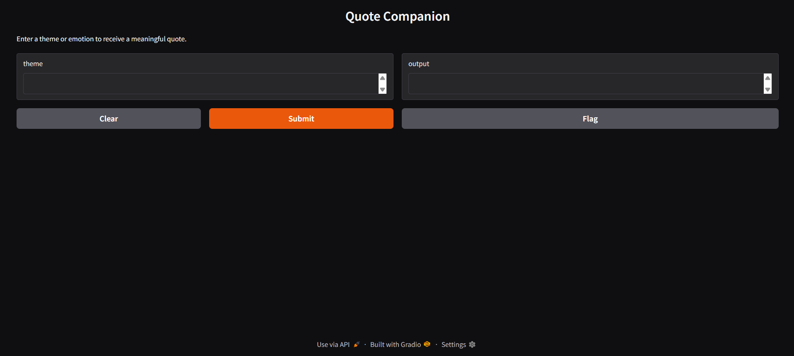

# 💬 Quote Companion

**Quote Companion** is a lightweight, locally-run web app that generates meaningful quotes based on user-provided themes or emotions. It uses LangChain’s Retrieval-Augmented Generation (RAG) architecture with ChromaDB for semantic search and a HuggingFace model for natural language generation — all wrapped in a clean Gradio interface.

---

## 🖼️ Live Preview



> A clean, responsive interface built with Gradio. Users enter a theme like “courage” or “failure” and receive a meaningful quote instantly. Powered entirely by local models and vector search.

---

## 🧠 Features

- 🔍 Semantic quote retrieval using ChromaDB
- 🧠 Lightweight LLM generation via HuggingFace (`distilGPT2`)
- 💡 Simple Gradio UI for theme-based quote generation
- 📁 Local CSV dataset for full offline functionality
- 🛠️ Built entirely with Python and Command Prompt (no bash or PowerShell)

---

## 🧰 Tech Stack

| Tool                   | Purpose                            |
|------------------------|-------------------------------------|
| **LangChain**          | RAG pipeline orchestration          |
| **ChromaDB**           | Vector store for semantic retrieval |
| **HuggingFace**        | Lightweight LLM for generation      |
| **Gradio**             | UI framework for user interaction   |
| **Python + CMD**       | Environment setup and execution     |

---

## 📁 Project Structure

Quote Companion/
├── app.py              # Gradio interface
├── rag_chain.py        # RAG pipeline setup
├── data/
│   └── quotes.csv      # Custom quote dataset
├── requirements.txt    # Dependencies
└── README.md           # Project documentation


---

### 📊 Dataset Format

```markdown
## 📊 Dataset Format

`quotes.csv` should look like this:

```csv
theme,quote
courage,"Courage is resistance to fear, mastery of fear—not absence of fear. – Mark Twain"
failure,"Failure is simply the opportunity to begin again, this time more intelligently. – Henry Ford"
love,"Love recognizes no barriers. – Maya Angelou"


---

### 🚀 Future Enhancements

```markdown
## 🚀 Future Enhancements

- Save-to-favorites button
- Quote history sidebar
- API integration for external quote sources
- Deployment via HuggingFace Spaces or LangServe

## 🙋‍♀️ About the Creator

Built by **Durga Raviteja Malisetty**, a hands-on learner passionate about clean architecture, minimal design, and real-world AI applications. This project reflects growing expertise in LangChain, ChromaDB, HuggingFace, and Gradio — all orchestrated with precision from the command line.
